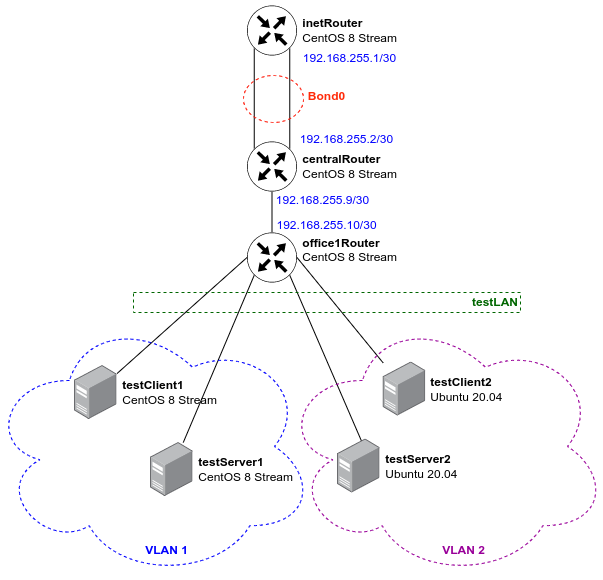

# Цель домашнего задания
Создать домашнюю сетевую лабораторию. Изучить основы DNS, научиться работать с технологией Split-DNS в Linux-based системах
<pre>
Описание домашнего задания
в Office1 в тестовой подсети появляется сервера с доп интерфесами и адресами
в internal сети testLAN: 
- testClient1 - 10.10.10.254
- testClient2 - 10.10.10.254
- testServer1- 10.10.10.1 
- testServer2- 10.10.10.1

Равести вланами:
testClient1 <-> testServer1
testClient2 <-> testServer2

Между centralRouter и inetRouter "пробросить" 2 линка (общая inernal сеть) и объединить их в бонд, проверить работу c отключением интерфейсов

Формат сдачи ДЗ - vagrant + ansible

</pre>

Формат сдачи ДЗ - vagrant + ansible

## Введение
Иногда требуется разделить сеть на несколько подсетей, для этого отлично подходит технология VLAN`ов. 
VLAN (Virtual Local Area Network, виртуальная локальная компьютерная сеть) -  это виртуальные сети, которые работают на втором уровне модели OSI. Протокол VLAN разделяет хосты на подсети, путём добавления тэга к каждоум кадру (Протокол 802.1Q).
Принцип работы VLAN:
Группа устройств в сети VLAN взаимодействует так, будто устройства подключены с помощью одного кабеля…
Преимущества использования VLAN:
Безопасность
Снижение издержек
Повышение производительности (уменьшение лишнего трафика)
Сокращение количества доменов широковещательной рассылки
Повышение производительности ИТ-отдела

Пакеты между VLAN могут передаваться только через маршрутизатор или коммутатор 3-го уровня. 

Если через один порт требуется передавать сразу несколько VLAN`ов, то используются Trunk-порты.

Помимо VLAN иногда требуется объединить несколько линков, это делается для увеличения отказоустойчивости. 
Агрегирование каналов (англ. link aggregation) — технологии объединения нескольких параллельных каналов передачи данных в сетях Ethernet в один логический, позволяющие увеличить пропускную способность и повысить надёжность. В различных конкретных реализациях агрегирования используются альтернативные наименования: транкинг портов (англ. port trunking), связывание каналов (link bundling), склейка адаптеров (NIC bonding), сопряжение адаптеров (NIC teaming).

LACP (англ. link aggregation control protocol) — открытый стандартный протокол агрегирования каналов, описанный в документах IEEE 802.3ad и IEEE 802.1aq.
Главное преимущество агрегирования каналов в том, что потенциально повышается полоса пропускания: в идеальных условиях полоса может достичь суммы полос пропускания объединённых каналов. Другое преимущество — «горячее» резервирование линий связи: в случае отказа одного из агрегируемых каналов трафик без прерывания сервиса посылается через оставшиеся, а после восстановления отказавшего канала он автоматически включается в работу

# Решение:

## 1. Работа со стендом и настройка DNS
<pre>
Данный Vagrantfile развернёт 7 виртаульных машин:
 - 5 ВМ на CentOS 8 Stream
 - 2 ВМ на Ubuntu 20.04 

Обратите внимание, что хосты testClient1, testServer1, testClient2 и testServer2 находятся в одной сети (testLAN). 

Для использования Ansible, каждому хосту выделен ip-адрес из подсети 192.168.56.0/24.
По итогу выполнения домашнего задания у нас должна получиться следующая топология сети: 
</pre>

## Проверка настройки VLAN на хостах

### Проверим настройку VLAN на RHEL-based системах:
Проверим настройку интерфейса, если настройка произведена правильно, то с хоста testClient1 будет проходить ping до хоста testServer1:
<pre>
[vagrant@testClient1 ~]$ ip a
1: lo: <LOOPBACK,UP,LOWER_UP> mtu 65536 qdisc noqueue state UNKNOWN group default qlen 1000
    link/loopback 00:00:00:00:00:00 brd 00:00:00:00:00:00
    inet 127.0.0.1/8 scope host lo
       valid_lft forever preferred_lft forever
2: eth0: <BROADCAST,MULTICAST,UP,LOWER_UP> mtu 1500 qdisc fq_codel state UP group default qlen 1000
    link/ether 08:00:27:b7:f6:78 brd ff:ff:ff:ff:ff:ff
    inet 10.0.2.15/24 brd 10.0.2.255 scope global dynamic noprefixroute eth0
       valid_lft 85473sec preferred_lft 85473sec
3: eth1: <BROADCAST,MULTICAST,UP,LOWER_UP> mtu 1500 qdisc fq_codel state UP group default qlen 1000
    link/ether 08:00:27:5d:1f:8f brd ff:ff:ff:ff:ff:ff
    inet6 fe80::5025:c697:230f:6c1d/64 scope link noprefixroute 
       valid_lft forever preferred_lft forever
4: eth2: <BROADCAST,MULTICAST,UP,LOWER_UP> mtu 1500 qdisc fq_codel state UP group default qlen 1000
    link/ether 08:00:27:fe:5a:98 brd ff:ff:ff:ff:ff:ff
    inet 192.168.56.21/24 brd 192.168.56.255 scope global noprefixroute eth2
       valid_lft forever preferred_lft forever
    inet6 fe80::a00:27ff:fefe:5a98/64 scope link 
       valid_lft forever preferred_lft forever
5: eth1.1@eth1: <BROADCAST,MULTICAST,UP,LOWER_UP> mtu 1500 qdisc noqueue state UP group default qlen 1000
    link/ether 08:00:27:5d:1f:8f brd ff:ff:ff:ff:ff:ff
    inet 10.10.10.254/24 brd 10.10.10.255 scope global noprefixroute eth1.1
       valid_lft forever preferred_lft forever
[vagrant@testClient1 ~]$ ping 10.10.10.1
PING 10.10.10.1 (10.10.10.1) 56(84) bytes of data.
64 bytes from 10.10.10.1: icmp_seq=1 ttl=64 time=0.741 ms
64 bytes from 10.10.10.1: icmp_seq=2 ttl=64 time=0.613 ms
64 bytes from 10.10.10.1: icmp_seq=3 ttl=64 time=0.644 ms
64 bytes from 10.10.10.1: icmp_seq=4 ttl=64 time=0.651 ms
^C
--- 10.10.10.1 ping statistics ---
4 packets transmitted, 4 received, 0% packet loss, time 3083ms
rtt min/avg/max/mdev = 0.613/0.662/0.741/0.051 ms
[vagrant@testClient1 ~]$ 

</pre>

### Проверим настройку VLAN на Ubuntu:
<pre>
vagrant@testClient2:~$ ip a
1: lo: <LOOPBACK,UP,LOWER_UP> mtu 65536 qdisc noqueue state UNKNOWN group default qlen 1000
    link/loopback 00:00:00:00:00:00 brd 00:00:00:00:00:00
    inet 127.0.0.1/8 scope host lo
       valid_lft forever preferred_lft forever
    inet6 ::1/128 scope host 
       valid_lft forever preferred_lft forever
2: enp0s3: <BROADCAST,MULTICAST,UP,LOWER_UP> mtu 1500 qdisc fq_codel state UP group default qlen 1000
    link/ether 02:60:50:11:b6:59 brd ff:ff:ff:ff:ff:ff
    inet 10.0.2.15/24 brd 10.0.2.255 scope global dynamic enp0s3
       valid_lft 85713sec preferred_lft 85713sec
    inet6 fe80::60:50ff:fe11:b659/64 scope link 
       valid_lft forever preferred_lft forever
3: enp0s8: <BROADCAST,MULTICAST,UP,LOWER_UP> mtu 1500 qdisc fq_codel state UP group default qlen 1000
    link/ether 08:00:27:06:10:8e brd ff:ff:ff:ff:ff:ff
    inet6 fe80::a00:27ff:fe06:108e/64 scope link 
       valid_lft forever preferred_lft forever
4: enp0s19: <BROADCAST,MULTICAST,UP,LOWER_UP> mtu 1500 qdisc fq_codel state UP group default qlen 1000
    link/ether 08:00:27:86:d4:41 brd ff:ff:ff:ff:ff:ff
    inet 192.168.56.31/24 brd 192.168.56.255 scope global enp0s19
       valid_lft forever preferred_lft forever
    inet6 fe80::a00:27ff:fe86:d441/64 scope link 
       valid_lft forever preferred_lft forever
5: vlan2@enp0s8: <BROADCAST,MULTICAST,UP,LOWER_UP> mtu 1500 qdisc noqueue state UP group default qlen 1000
    link/ether 08:00:27:06:10:8e brd ff:ff:ff:ff:ff:ff
    inet 10.10.10.254/24 brd 10.10.10.255 scope global vlan2
       valid_lft forever preferred_lft forever
    inet6 fe80::a00:27ff:fe06:108e/64 scope link 
       valid_lft forever preferred_lft forever
vagrant@testClient2:~$ ping 10.10.10.1
PING 10.10.10.1 (10.10.10.1) 56(84) bytes of data.
64 bytes from 10.10.10.1: icmp_seq=1 ttl=64 time=0.929 ms
64 bytes from 10.10.10.1: icmp_seq=2 ttl=64 time=0.501 ms
64 bytes from 10.10.10.1: icmp_seq=3 ttl=64 time=0.416 ms
64 bytes from 10.10.10.1: icmp_seq=4 ttl=64 time=0.571 ms
64 bytes from 10.10.10.1: icmp_seq=5 ttl=64 time=0.548 ms
^C
--- 10.10.10.1 ping statistics ---
5 packets transmitted, 5 received, 0% packet loss, time 4095ms
rtt min/avg/max/mdev = 0.416/0.593/0.929/0.176 ms
vagrant@testClient2:~$ 
</pre>

## Проверка настройки LACP между хостами inetRouter и centralRouter

Запустим ping до centralRouter (192.168.255.2):

<pre>
[vagrant@inetRouter ~]$ ping 192.168.255.2
PING 192.168.255.2 (192.168.255.2) 56(84) bytes of data.
64 bytes from 192.168.255.2: icmp_seq=1 ttl=64 time=1.03 ms
64 bytes from 192.168.255.2: icmp_seq=2 ttl=64 time=0.724 ms
64 bytes from 192.168.255.2: icmp_seq=3 ttl=64 time=0.539 ms
64 bytes from 192.168.255.2: icmp_seq=4 ttl=64 time=0.627 ms
64 bytes from 192.168.255.2: icmp_seq=5 ttl=64 time=0.952 ms
64 bytes from 192.168.255.2: icmp_seq=6 ttl=64 time=0.585 ms
64 bytes from 192.168.255.2: icmp_seq=7 ttl=64 time=0.576 ms
64 bytes from 192.168.255.2: icmp_seq=8 ttl=64 time=0.512 ms
64 bytes from 192.168.255.2: icmp_seq=9 ttl=64 time=0.577 ms
64 bytes from 192.168.255.2: icmp_seq=10 ttl=64 time=0.465 ms
64 bytes from 192.168.255.2: icmp_seq=11 ttl=64 time=0.565 ms
64 bytes from 192.168.255.2: icmp_seq=12 ttl=64 time=0.556 ms
64 bytes from 192.168.255.2: icmp_seq=13 ttl=64 time=0.574 ms
64 bytes from 192.168.255.2: icmp_seq=14 ttl=64 time=0.504 ms
64 bytes from 192.168.255.2: icmp_seq=15 ttl=64 time=0.559 ms
64 bytes from 192.168.255.2: icmp_seq=16 ttl=64 time=0.550 ms
64 bytes from 192.168.255.2: icmp_seq=17 ttl=64 time=0.555 ms
64 bytes from 192.168.255.2: icmp_seq=19 ttl=64 time=1.04 ms
64 bytes from 192.168.255.2: icmp_seq=20 ttl=64 time=0.797 ms
64 bytes from 192.168.255.2: icmp_seq=21 ttl=64 time=0.598 ms
64 bytes from 192.168.255.2: icmp_seq=22 ttl=64 time=0.694 ms
64 bytes from 192.168.255.2: icmp_seq=23 ttl=64 time=0.568 ms
^C
--- 192.168.255.2 ping statistics ---
23 packets transmitted, 22 received, 4.34783% packet loss, time 23046ms
rtt min/avg/max/mdev = 0.465/0.643/1.042/0.161 ms
[vagrant@inetRouter ~]$ 

Не отменяя ping подключаемся к хосту centralRouter и выключаем там интерфейс eth1: 

[root@centralRouter ~]# ip link set down eth1

После данного действия ping не пропал, так как трафик пошел по-другому порту.
</pre>

